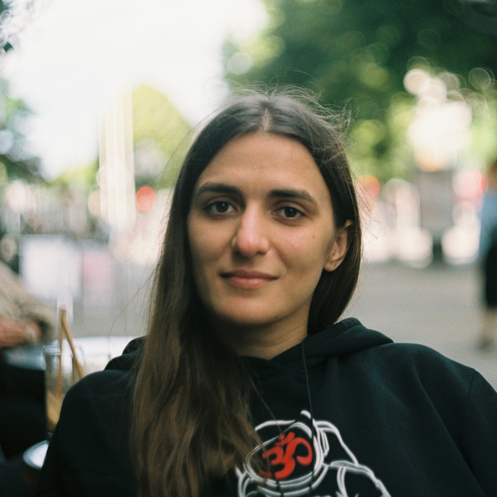

---
title: Anna Yudenko
...

::: { .container }

::: { .leftcol }
{ .avatar }

# Anna Yudenko

{             .icon .fa .fa-twitter }
{ .icon .fa .fa-instagram }
{ .icon .ai .ai-google-scholar }

[Laboratory of structural analysis and engineering of membrane systems, MIPT](https://cmm-mipt.ru/gushchin-lab/)

[Laboratory of nanobiotechnology, Alferov University of the RAS](https://spbau.ru/)
:::

::: { .rightcol }

# About me

I'm Anna, a biophysicist working at Moscow Institute of Physics and Tecnnology (MIPT).

::: { .multicol }

::: { .col }
### Interests
- Tomatoes
- Strawberry
- Working really a lot
- Cats
:::

::: { .col }
### Education
- []{ .fa-solid .fa-graduation-cap } PhD in Biophysics, Sep 2022
- []{ .fa-solid .fa-graduation-cap } MSc in Physics, 2011 — 2013
- []{ .fa-solid .fa-graduation-cap } BSc in Physics, 2007 — 2011
:::

:::

:::

:::
